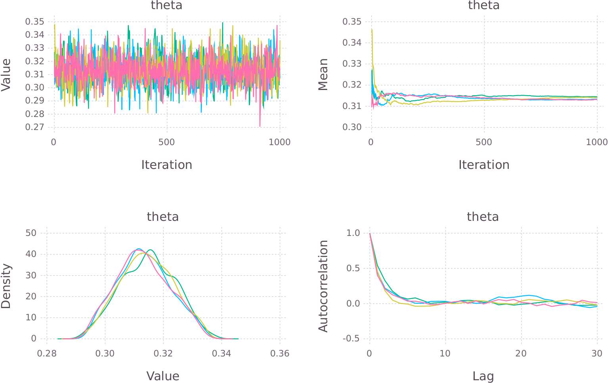

```{r setup, include=FALSE}
# knitr::opts_chunk$set(echo = TRUE)
library(dplyr)
library(stringr)
```

# {.col-2}

## Introduction

<div class="fullwidth">
Data are generally analysed within the framework of a model. Assuming that the model is parametric then the analysis will involve finding the most likely values for the model parameters. Bayes' Theorem makes it possible to use data and prior beliefs (or knowledge!) for parameter estimation. Furthermore, it provides not only the most likely parameter values but also their probability distribution.

$$
p(\theta|y, X) = \frac{p(y|X, \theta) p(\theta)}{p(y)} \propto p(y|\theta) p(\theta)
$$

Stan[@stan-ref] is a probabilistic programming language. It uses Markov Chain Monte Carlo (MCMC) to generate samples from the posterior distribution.

The `Stan.jl` package[@stanjl-ref] provides an interface to Stan from Julia. It depends on the shell interface to Stan, `CmdStan`. Set the `CMDSTAN_HOME` environment variable to the folder in which `CmdStan` was installed.

```
> Pkg.add("Stan")
> using Stan
> using Mamba
```

The `Mamba`[@mamba-doc] package is used to handle the results from Stan.
</div>

## Case Study

<div class="fullwidth">
We'll be using `Stan.jl` to analyse data gathered from a slot machine. The objective is to estimate the hit rate (success probability) by fitting a binomial distribution to the data.

A sample of the data:

```
   session  spins  hits wager payout hit_rate    rtp
 1       1      7     2    10      3   0.2857 0.3000
 2       2     19     7    30     29   0.3684 0.9666
 3       3     19     3    22      3   0.1578 0.1363
 4       4     26     7    30     13   0.2692 0.4333
 5       5     23     8    31     35   0.3478 1.1290
```

Wrap the salient columns in a dictionary.

```
> const binomial_data = Dict("N"     => size(slots, 1),
                             "hits"  => slots[:hits],
                             "spins" => slots[:spins])
```
</div>

## The Model

<div class="fullwidth">
The Stan model can be defined as a string or in an external file.

```
> const binomial_model = "
data {
  int<lower=0> N;
  int hits[N];
  int spins[N];
}
parameters {
  real<lower=0,upper=1> theta;
}
model {
  hits ~ binomial(spins, theta);       // Likelihood
  theta ~ beta(2, 2);                  // Prior
}
";
```
The prior is a Beta distribution which constrains the success rate to the interval between 0 and 1 and (weakly) suggests that the most likely value is around 0.5.
</div>

# {.col-2}

## Results

### Compile and Execute {.fullwidth}

<div class="fullwidth">
Create a `Stanmodel` object. The constructor accepts numerous arguments which can be used to customise the way that the problem is run.

```
> stanmodel = Stanmodel(model=binomial_model, nchains=4,
                        num_samples=1000, num_warmup=1000);
```

Generate samples from the posterior.

```
> rc, simulated = stan(stanmodel, [binomial_data]);
```

Result returned as a `Mamba.Chains` object. A wide range of diagnostics are available through `Mamba` to check on the convergence of the chains.
</div>

### Results {.fullwidth}

Obtain high level summary of results (statistics of parameter distribution).

```
> describe(simulated[:, ["theta"], :], q=[0.025, 0.5, 0.975])
```
```
Empirical Posterior Estimates:
         Mean      SD Naive SE     MCSE  ESS
theta 0.31289 0.01064 0.000168 0.000290 1000

Quantiles:
         2.5%   50.0%   97.5%  
theta 0.29309 0.31279 0.33427
```

Deeper insight using plots are generated using `Gadfly`[@gadfly-doc].



This case study was presented in greater detail at eRum[@erum-video; @erum-slides].

## References

<div class="fullwidth">
This poster was created using R Markdown and `drposter`[@drposter-ref] with FontAwesome icons via `icon`[@icon-ref] and diagrams using `DiagrammeR`[@diagrammer-ref] and GraphViz.
</div>

<div id="refs" class="references"></div>

# {.col-1}

## Workflow {style="--header-color:darkred; --other-color-for-h2-gradient:red;"}

```{r, echo = FALSE}
DiagrammeR::grViz("workflow.gv")
```
